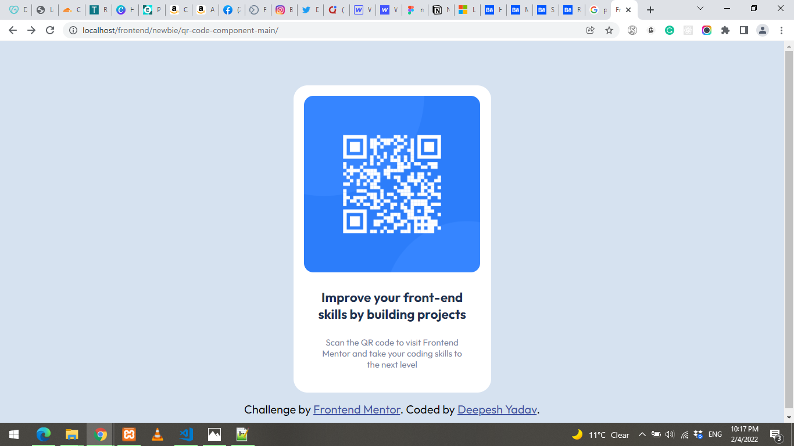
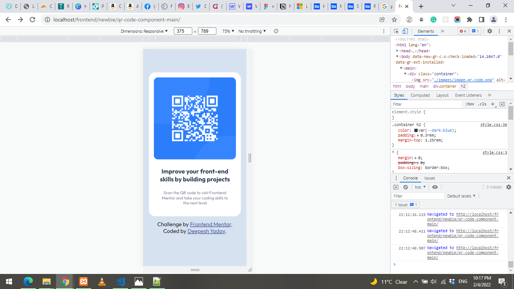

# Frontend Mentor - QR code component solution


## Welcome! 👋

This is a solution to the [QR code component challenge on Frontend Mentor](https://www.frontendmentor.io/challenges/qr-code-component-iux_sIO_H). Frontend Mentor challenges help you improve your coding skills by building realistic projects.

## Table of contents

- [Overview](#overview)
  - [Screenshot](#screenshot)
  - [Links](#links)
- [My process](#my-process)
  - [Built with](#built-with)
  - [What I learned](#what-i-learned)
  - [Continued development](#continued-development)
- [Author](#author)

## Overview

### Screenshot




### Links

- Solution URL: [Codepen Solution](https://codepen.io/deepeshyadav/pen/mdqrxby)
- Live Site URL: [Github page Live](https://deepeshyadavrd.github.io/qr-code-component/)

## My process

### Built with

- Semantic HTML5 markup
- CSS custom properties
- Flexbox
- CSS Grid
- Mobile-first workflow

### What I learned

I was very simple, I made it for mobile screen first. Keeping eye on details it was very easy

```html
<h1>Some HTML code I'm proud of</h1>
```

```css
.container {
  background-color: var(--white);
  text-align: center;
  padding: 1.15rem;
  margin-top: 4rem;
  margin-bottom: 1rem;
  border-radius: 1.5rem;
}
```

## Author

- Website - [Deepesh Yadav](https://deepeshyadavrd.carrd.co)
- Frontend Mentor - [@deepeshyadavrd](https://www.frontendmentor.io/profile/deepeshyadavrd)
- Twitter - [@mrbigtech](https://www.twitter.com/mrbigtech)
- Codepen - [@deepeshyadav](https://codepen.io/deepeshyadav)
